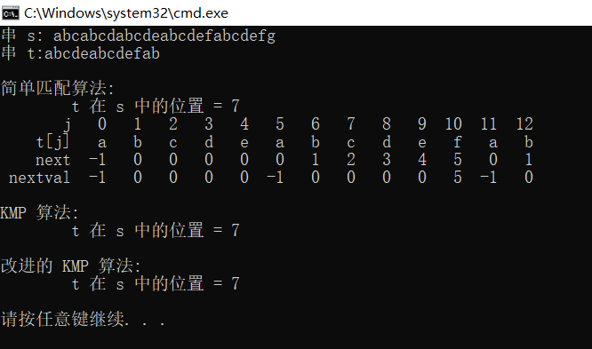

<b>数据结构</b>

<b>2022</b>

 

<big><big><big><big><b>实验报告</b></big></big></big></big>

 
 
 
 
 
 
 
 

实验项目名称：实现顺序串的各种模式匹配算法

班级：2021级6班

学号：2021302181138

姓名：伍旺旺

指导教师：沈志东

实验时间：2022年4月14日

<big><b>实验四: 实现顺序串的各种模式匹配算法</b></big>

---

### 一、实验要求
编写一个程序 exp4-3.cpp，实现顺序串的各种模式匹配运算，并在此基础上完成题干要求的 5 个功能。

 
 
 
 

---

### 二、实验环境

硬件：微型计算机

软件：Windows 操作系统、Microsoft Visual Studio Code

 
 
 
 

---

### 三、实验步骤及思路

1. 题目分析
根据题目要求，该程序分为以下 5 个模块：
~~~cpp
int Index(SqString s,SqString t); //简单匹配算法
void GetNext(SqString t,int next[]); //由模式串 t 求出 next 串
int KMPIndex(SqString s,SqString t); //KMP 算法
void GetNextval(SqString t,int nextval[]); //由模式串 t 求出 nextval 值
int KMPIndex1(SqString s,SqString t); //修正的 KMP 算法
~~~

2. 实验具体步骤

2.1 简单匹配算法：
~~~cpp
int Index(SqString s,SqString t)
{
    int i = 0;
    int j = 0;

    while(i < s.length && j < t.length)
    {
        if(s.data[i] == t.data[j])
        {
            i++;
            j++;
        }
        else
        {
            i = i - j + 1;
            j = 0;
        }
    }
    if(j >= t.length)
        return (i - t.length);
    else
        return (-1);
}
~~~

2.2 由模式串 t 求出 next 串
~~~cpp
void GetNext(SqString t,int next[])
{
    int j,k;
    j = 0;
    k = -1;
    next[0] = -1;

    while(j < t.length - 1) 
    {
        if(k == -1 || t.data[j] == t.data[k])
        {
            j++;
            k++;
            next[j] = k;
        }
        else
            k = next[k];
    }
}
~~~

2.3 KMP 算法
~~~cpp
int KMPIndex(SqString s,SqString t)
{
    int next[MaxSize];
    int i = 0;
    int j = 0;

    GetNext(t,next);
    while(i < s.length && j < t.length)
    {
        if(j == -1 || s.data[i] == t.data[j])
        {
            i++;
            j++;
        }
        else
            j = next[j];
    }
    if(j >= t.length)
        return (i - t.length);
    else
        return (-1);
}
~~~

2.4 由模式串 t 求出 nextval 值
~~~cpp
void GetNextval(SqString t,int nextval[])
{
    int j = 0;
    int k = -1;
    nextval[0] = -1;

    while(j < t.length)
    {
        if(k == -1 || t.data[j] == t.data[k])
        {
            j++;
            k++;
            if(t.data[j] != t.data[k])
                nextval[j] = k;
            else
                nextval[j] = nextval[k];
        }
        else
            k = nextval[k];
    }
}
~~~

2.5 修正的 KMP 算法
~~~cpp
int KMPIndex1(SqString s,SqString t)
{
    int nextval[MaxSize];
    int i = 0;
    int j = 0;

    GetNextval(t,nextval);
    while(i < s.length && j < t.length)
    {
        if(j == -1 || s.data[i] == t.data[j])
        {
            i++;
            j++;
        }
        else    
            j = nextval[j];
    }
    if(j >= t.length)
        return (i - t.length);
    else
        return (-1);
}
~~~

 
 
 
 

---

### 四、实验结果及分析
实验结果如下图所示：

 
 
 
 

___

### 五、总结
通过此次实验对串的模式匹配算法（BF 和 KMP 算法）有了更进一步的认识。